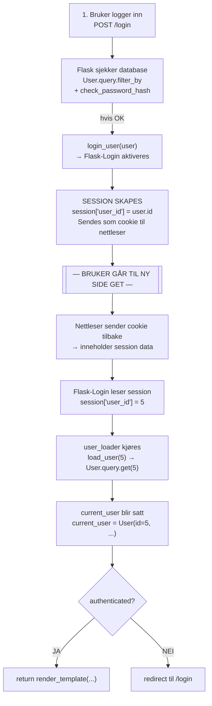

# APP.PY – Dokumentasjon

Dokumentasjon av Flask-appens konfigurasjon, innloggingssystem, databasemodeller og ruter.

---

## Innhold

- [Konfigurasjon](#konfigurasjon)
- [Flask-Login](#flask-login)
- [Databasemodeller](#databasemodeller)
  - [User](#user)
  - [Section](#section)
  - [Topic](#topic)
  - [LearningElement](#learningelement)
  - [Progress](#progress)
  - [OpenAnswer](#openanswer)
  - [TopicVisit](#topicvisit)
  - [Total databasestruktur](#total-databasestruktur)
- [Admin-oppsett](#admin-oppsett)
- [@admin\_required Decorator](#admin_required-decorator)
- [Ruter](#ruter)
  - [Login](#login-rute)
  - [Register](#register-rute)
  - [Logg ut](#logg-ut-rute)
  - [Index](#index-rute)
  - [Section](#section-rute)

---
---
---

# 1. Konfigurasjon

> Setter opp Flask-appen, databasetilkobling og hemmelig nøkkel for session-håndtering.

---

### `Flask(__name__)`

```python
app = Flask(__name__)
```

Lager Flask-appen. `__name__` brukes til å finne filens modulstil, og gjør at Flask vet hvor den finner `templates`- og `static`-mapper.

---

### `SECRET_KEY`

```python
app.config['SECRET_KEY'] = '108158379'
```

Brukes til å signere session cookies. Innlogging fungerer ikke uten denne nøkkelen. Uten en `SECRET_KEY` kan brukere i teorien manipulere session-data.

> **Session cookies** er midlertidig data som brukes av nettsider for å huske informasjon om deg mens du navigerer fra side til side i løpet av ett enkelt besøk. De lagrer informasjon om brukeren (for eksempel innloggingsstatus) mellom forespørsler til serveren.

 **Cookies** (informasjonskapsler): Lagres lokalt i nettleseren på din egen PC eller mobil.
 **Sessions** (sesjoner): Lagres på serveren til nettstedet du besøker.

| Egenskap | Cookies | Sessions |
|---|---|---|
| Lagringssted | Klienten (din nettleser) | Serveren (nettstedets datamaskin) |
| Sikkerhet | Mindre sikker (data kan leses/endres av brukeren) | Mer sikker (data er utilgjengelig for brukeren) |
| Kapasitet | Veldig liten (maks 4 KB) | Stor (avhenger av serverens minne) |
| Varighet | Kan vare i dager, uker eller år (til den utløper eller slettes) | Slettes vanligvis når du lukker nettleseren eller logger ut |
| Bruk | Huske brukernavn, språkvalg, annonsesporing | Handlekurv, innloggingsstatus, sensitiv informasjon |


**Når du går til en ny side:**
1. Du klikker en link
2. Nettleseren sender cookie med request
3. Flask leser cookie
4. Flask sier: "aha, dette er user 1"
5. `current_user` blir satt automatisk

Uten denne hadde du mistet `login_user()`-kommandoen.

**⚠️ Hva kan gå galt uten:**
- Sessions kan forfalskes
- Flask kan nekte å bruke sessions
- Brukere kan utgi seg for andre

**🧩 Funksjoner du mister:**
- `session`
- `login_user()`
- Huske innlogget bruker mellom requests

---

### `SQLALCHEMY_DATABASE_URI`

```python
app.config['SQLALCHEMY_DATABASE_URI'] = 'sqlite:///database.db'
```

Forteller hvilken database Flask bruker. Her brukes SQLite, og databasen lagres i filen `database.db`. De tre skråstrekene `///` betyr at stien er relativ til prosjektmappen.

Dette kalles en URI (Uniform Resource Identifier) – en standard måte å beskrive hvor en ressurs (her: database) befinner seg og hvordan man kobler til den.

**⚠️ Hva kan gå galt uten:**
- Appen krasjer ved oppstart
- Ingen data blir lagret
- Login-system fungerer ikke

**🧩 Funksjoner du mister:**
- Lagring av brukere
- Databasebasert login
- All persistent data

---

### `SQLAlchemy(app)`

```python
db = SQLAlchemy(app)
```

Kobler Flask til databasen, slik at databasen blir tilgjengelig overalt i appen.

SQLAlchemy er en **ORM (Object Relational Mapper)**, som betyr at du kan jobbe med databasen ved å bruke Python-klasser i stedet for rå SQL.

```python
User.query.all()    # ORM
SELECT * FROM user; # Rå SQL
```

**⚠️ Hva kan gå galt uten:**
- Ingen database-tilgang
- Queries krasjer

**🧩 Funksjoner du mister:**
- `db.Model`
- `db.session.add()`
- `db.session.commit()`
- `User.query.get()`

---
---
---

# 2. Flask-Login

> Setter opp innloggingssystemet og definerer hvordan Flask henter og gjenkjenner innloggede brukere.

---

### `LoginManager(app)`

```python
login_manager = LoginManager(app)
```

Kobler Flask til login-systemet. Dette gjør at `current_user` blir tilgjengelig i alle ruter, og hjelper med å håndtere session cookies og vite hvem som er logget inn.

**⚠️ Hva kan gå galt uten:**
- Login-system fungerer ikke
- Appen vet ikke hvem som er logget inn

**🧩 Funksjoner du mister:**
- `current_user`
- `login_user()`
- `logout_user()`
- `@login_required`

---

### `login_view`

```python
login_manager.login_view = 'login'
```

Hvis noen prøver å gå til en beskyttet side uten å være logget inn, vil de automatisk bli sendt til ruten `login`.

**⚠️ Hva kan gå galt uten:**
- Bruker får bare 401/403 error
- Ingen redirect til login-side

**🧩 Funksjoner du mister:**
- Automatisk redirect ved `@login_required`
- Bedre brukeropplevelse

---

### `user_loader`

```python
@login_manager.user_loader
def load_user(user_id):
    return User.query.get(int(user_id))
```

`user_loader` er en callback-funksjon som Flask trenger. Når en bruker allerede er logget inn, lagrer Flask `user_id`, og når den trenger ID-en igjen sier den bare: *"Gi meg brukeren med denne user_id."*

Funksjonen lar `flask_login` hente brukere fra databasen. Den kalles automatisk ved hver forespørsel som bruker session-cookies med bruker-ID. Den henter brukeren fra databasen (`return User.query.get`) og konverterer cookie-ID-en til heltall (`int(user_id)`), siden ID-en i databasen er et heltall og `user_id` ofte er en string.

**Når du besøker en ny side:**
1. Nettleseren sender session-cookie til Flask
2. Flask-Login leser cookie
3. Den ser: "aha, user_id = 1"
4. Da kaller den user_loader-funksjonen

**⚠️ Hva kan gå galt uten:**
- Flask-Login finner ikke brukeren
- Bruker virker ikke innlogget

**🧩 Funksjoner du mister:**
- `current_user`
- Persistente sessions
- Automatisk gjenkjenning av bruker

---



---

### 💡 Oppsummert – hva skjer uten hva

| Linje | Hva du mister |
|---|---|
| `SECRET_KEY` | `session`, `login_user` |
| `DATABASE_URI` | database |
| `SQLAlchemy` | db-funksjoner |
| `LoginManager` | hele login-systemet |
| `login_view` | redirect |
| `user_loader` | `current_user` |

---
---
---

# 3. Databasemodeller

> Definerer strukturen til databasen. Hver klasse tilsvarer én tabell, og hver `db.Column` tilsvarer én kolonne i den tabellen.

---

## `User`

> Lagrer alle brukere i systemet, både vanlige brukere og admins.

```python
class User(UserMixin, db.Model):
    id            = db.Column(db.Integer, primary_key=True)
    username      = db.Column(db.String(80),  unique=True,  nullable=False)
    password_hash = db.Column(db.String(200),               nullable=False)
    is_admin      = db.Column(db.Boolean, default=False)
```

Dette er en databasemodell. Alt som arver fra `db.Model` er en databasemodell, der `db.Column` definerer en kolonne i en tabell. `UserMixin` brukes ved innloggingssystemer i Flask.

Meningen er å kunne legge ting i databasen, hvor SQLite gjør alt bak kulissene uten at du trenger å gjøre det manuelt. Alt ligger i vanlige databaserader som `id`, `username`, `password` og om det er admin.

| Attributt | Type | Forklaring |
|---|---|---|
| `id` | `db.Integer` | Heltall. `primary_key=True` gjør at ID-er skrives unikt nedover automatisk (1, 2, 3 …) |
| `username` | `db.String(80)` | Tekst, maks 80 tegn. `unique=True` betyr at samme brukernavn ikke kan brukes to ganger |
| `password_hash` | `db.String(200)` | Tekst, maks 200 tegn. Passord lagres som en hash, så de vises aldri i klartekst |
| `is_admin` | `db.Boolean` | True/False. `default=False` betyr at ingen blir admin uten grunn |

`db.Integer`, `db.String` og `db.Boolean` definerer hva slags datatype som skal legges inn i databasen. `nullable=False` betyr at feltet ikke kan være tomt. Tallene i parentes `(80)` og `(200)` fungerer som `VARCHAR` i SQL: de begrenser antall tegn slik at databasen ikke lagrer unødvendig mye.

**Eksempel i databasen:**

| id | username | password_hash | is_admin |
|----|----------|---------------|----------|
| 1  | ola      | `(hash)`      | False    |
| 2  | kari     | `(hash)`      | True     |

---

## `Section`

> Lagrer de overordnede seksjonene i læringsplattformen – det øverste nivået i innholdshierarkiet.

```python
class Section(db.Model):
    id          = db.Column(db.Integer, primary_key=True)
    title       = db.Column(db.String(100), nullable=False)
    description = db.Column(db.Text)
    emoji       = db.Column(db.String(10))
    topics      = db.relationship('Topic', backref='section', lazy=True,
                                  cascade='all, delete-orphan')
```

Denne tabellen er for seksjoner innenfor læringsplattformen. Akkurat som `User` har den `id`, `title` og `description`. Noe som er annerledes er at den bruker både `String(100)` og `Text`.

`String` og `Text` er begge datatyper i databasen. Forskjellen er at `String` har en maks lengde (for eksempel 100 tegn), mens `Text` brukes for lengre tekst uten en fast lengdebegrensning. `String` brukes ofte til korte tekster som brukernavn, e-post og titler, mens `Text` brukes til lengre innhold som beskrivelser.

I `topics` er det en `db.relationship` som connecter tabeller sammen. En section skal ha sub-sections, altså topics innenfor en section. Eksempel: *Nettverk → IP-adresse*.

| Parameter | Forklaring |
|---|---|
| `backref='section'` | Lager en reverse connection, så man kan gå fra en topic og tilbake til seksjonen den tilhører. Backref er ikke noen kobling, kun navigasjon slik at man kan gå fra child tilbake til parent – uten å endre på databasestrukturen. |
| `lazy=True` | Bestemmer hvordan data loades fra databasen. Når den er `True`, loades topics kun når du faktisk aksesserer dem. |
| `cascade='all, delete-orphan'` | Sørger for at det ikke finnes foreldreløse topics. Når du sletter en section, slettes alle topics innenfor den med. Gjelder alle cascade-operasjoner (save, change, delete). Topics kan også slettes individuelt uten å slette hele seksjonen. |

Basically betyr det:

> *"En section har mange topics. Hver topic vet hvilken section den tilhører. Når en section blir fjernet, blir topics fjernet med. Når en topic er fjernet fra en section, er den fjernet helt."*

```
Section (1)
   ├── Topic A
   ├── Topic B
   └── Topic C

Delete Section  →  sletter A, B og C
Remove Topic B  →  Topic B slettes
```

---

## `Topic`

> Lagrer undertemaer innenfor en section – det midterste nivået i innholdshierarkiet.

```python
class Topic(db.Model): 
    id         = db.Column(db.Integer, primary_key=True)
    title      = db.Column(db.String(100), nullable=False)
    section_id = db.Column(db.Integer, db.ForeignKey('section.id'), nullable=False)
    elements   = db.relationship('LearningElement', backref='topic', lazy=True,
                                 cascade='all, delete-orphan')
```

`Topic`-klassen er samme som `Section`, bare at denne har `db.relationship` med `LearningElement`. Planen er jo at det er en læringsnettside med ulike seksjoner, ulike topics og ulike oppgaver.

En annen viktig ting er `db.ForeignKey('section.id')`. Dette er koden som faktisk kobler sammen section og topic. Alle sections har en `primary_key` ID i databasen, og `section_id = ForeignKey('section.id')` gjør sånn at hver topic som blir lagt innenfor en section får en `section_id` tildelt som er det samme som databasens `section.id`.

---

## `LearningElement`

> Lagrer selve innholdet i et topic – enten tekst, quiz eller åpne spørsmål.

```python
class LearningElement(db.Model):
    id             = db.Column(db.Integer, primary_key=True)
    topic_id       = db.Column(db.Integer, db.ForeignKey('topic.id'), nullable=False)
    type           = db.Column(db.String(20),  nullable=False)
    content        = db.Column(db.Text)
    question       = db.Column(db.Text)
    option_a       = db.Column(db.String(200))
    option_b       = db.Column(db.String(200))
    option_c       = db.Column(db.String(200)) 
    option_d       = db.Column(db.String(200))
    correct_answer = db.Column(db.String(1))
    answer_key     = db.Column(db.Text)
```

Denne koden sier noe om hvor læringselementer skal lagres. Det er ikke visningen eller logikken av oppgavene selv, men bare lagring.

Kolonnen `type` sier noe om hvilken type læringselement det er. Dataene tolkes ulikt avhengig av verdien her.

#### Kolonner

| Kolonne | Type | Brukes av |
|---|---|---|
| `id` | `db.Integer` | Alle |
| `topic_id` | `db.Integer` (FK) | Alle |
| `type` | `db.String(20)` | Alle – styrer tolkningen |
| `content` | `db.Text` | `text` |
| `question` | `db.Text` | `quiz` |
| `option_a` – `option_d` | `db.String(200)` | `quiz` |
| `correct_answer` | `db.String(1)` | `quiz` |
| `answer_key` | `db.Text` | Åpne spørsmål |

#### Slik tolkes `type`

**`type = "text"`** – læringselement med tekstinnhold:

```python
LearningElement(
    type="text",
    content="Dette er en forklaring"
)
```

| type | content | question | option_a |
|------|---------|----------|----------|
| text | "Dette er..." | NULL | NULL |

**`type = "quiz"`** – flervalgsoppgave:

```python
LearningElement(
    type="quiz",
    question="Hva er 2 + 2?",
    option_a="3",
    option_b="4"
)
```

| type | content | question | option_a | option_b |
|------|---------|----------|----------|----------|
| quiz | NULL | "Hva er 2+2?" | "3" | "4" |

Den ferdige strukturen ser slik ut:

```
Nettverk → IP-adresse → Quiz / Åpen spørsmål / Description
```

På grunn av `backref='section'` kan man gå baklengs også.

---

## `Progress`

> Lagrer om en bruker har svart riktig eller feil på et læringselement.

```python
class Progress(db.Model):
    id         = db.Column(db.Integer, primary_key=True)
    user_id    = db.Column(db.Integer, db.ForeignKey('user.id'),             nullable=False)
    element_id = db.Column(db.Integer, db.ForeignKey('learning_element.id'), nullable=False)
    correct    = db.Column(db.Boolean)
```

Denne koden er ganske rett fram. Den har egen `id`. Den lager en `user_id` bassert på database `user.id`-en som er i bruk. `element_id` tar den fra `learning_element` id-en for å kunne se hvilken læringselement det gjelder. `correct` er True/False for å se om svaret er riktig eller feil.

> **(FK)** betyr Foreign Key, altså kobling til en annen tabell.

| Kolonne | Type | Forklaring |
|---|---|---|
| `id` | `db.Integer` | Primærnøkkel |
| `user_id` | `db.Integer` (FK) | Peker til `user.id` – hvilken bruker det gjelder |
| `element_id` | `db.Integer` (FK) | Peker til `learning_element.id` – hvilket læringselement det gjelder |
| `correct` | `db.Boolean` | `True` hvis svaret er riktig, `False` hvis feil |

**Eksempel i databasen:**

| id | user_id | element_id | correct |
|----|---------|------------|---------|
| 1  | 1       | 5          | True    |
| 2  | 1       | 6          | False   |
| 3  | 2       | 5          | True    |

Som du kan se har 2 brukere gjort samme oppgave riktig, men bruker 1 gjorde 2 oppgaver og fikk en av dem feil.

---

## `OpenAnswer`

> Lagrer brukerens tekstsvar på åpne spørsmål, uten å vurdere om det er riktig eller feil.

```python
class OpenAnswer(db.Model):
    id         = db.Column(db.Integer, primary_key=True)
    user_id    = db.Column(db.Integer, db.ForeignKey('user.id'),             nullable=False)
    element_id = db.Column(db.Integer, db.ForeignKey('learning_element.id'), nullable=False)
    answer     = db.Column(db.Text)
```

Denne tabellen er ganske lik `Progress`. Eneste forskjell er at istedet for at den lagrer om svaret er riktig eller ikke, så lagrer den bare svaret du gir. Fordi det er en åpen oppgave.

| Kolonne | Type | Forklaring |
|---|---|---|
| `id` | `db.Integer` | Primærnøkkel |
| `user_id` | `db.Integer` (FK) | Peker til `user.id` – hvilken bruker det gjelder |
| `element_id` | `db.Integer` (FK) | Peker til `learning_element.id` – hvilket læringselement det gjelder |
| `answer` | `db.Text` | Svaret brukeren skrev inn |

**Eksempel i databasen:**

| id | user_id | element_id | answer |
|----|---------|------------|--------|
| 1  | 1       | 6          | "Dette er mitt svar" |
| 2  | 2       | 6          | "Jeg skrev noe annet" |

Her kan du senere hente alle svar til et læringselement og evaluere dem manuelt eller via kode.

---

## `TopicVisit`

> Lagrer hvilke topics en bruker har besøkt – brukes til å spore fremgang i innholdshierarkiet.

```python
class TopicVisit(db.Model):
    id       = db.Column(db.Integer, primary_key=True)
    user_id  = db.Column(db.Integer, db.ForeignKey('user.id'),  nullable=False)
    topic_id = db.Column(db.Integer, db.ForeignKey('topic.id'), nullable=False)
```

Dette er en enkel kode som sier hvilke topics brukeren har besøkt. Det gjør den ved å referere til `user.id` og `topic.id` som er i bruk der og da.

| Kolonne | Type | Forklaring |
|---|---|---|
| `id` | `db.Integer` | Primærnøkkel |
| `user_id` | `db.Integer` (FK) | Peker til `user.id` – hvilken bruker det gjelder |
| `topic_id` | `db.Integer` (FK) | Peker til `topic.id` – hvilket topic som ble besøkt |

---

## Total databasestruktur

> Oversikt over alle tabeller og hvordan de henger sammen via relasjoner og fremmednøkler.

#### Innholdshierarki

```
INNHOLDSHIERARKI
════════════════════════════════════════════════════════════════════════

+-----------+         +-----------+         +-------------------+
|  Section  |         |   Topic   |         | LearningElement   |
+-----------+         +-----------+         +-------------------+
| id (PK)   |1      * | id (PK)   |1      * | id (PK)           |
| title     +-------->| title     +-------->| topic_id (FK)     |
| description         | section_id (FK)     | type              |
| emoji     |         |           |         | content           |
|           |         | .section  |<--------| question          |
|           |         | (backref) |         | option_a/b/c/d    |
| .topics   |<--------+           |         | correct_answer    |
| (backref) |         | .elements |<--------| answer_key        |
+-----------+         | (backref) |         |                   |
                      +-----------+         +-------------------+
```

#### Brukersporing

```
BRUKERSPORING
════════════════════════════════════════════════════════════════════════

                      +-----------+
                      |   User    |
                      +-----------+
                      | id (PK)   |
                      | username  |
                      | password_hash
                      | is_admin  |
                      +-----------+
                       1 |  | 1  | 1
           +-----------+ |  |    +-------------+
           |             |  |                  |
           | *           |  | *                | *
+---------------+  +---------------+  +---------------+
|   Progress    |  |  OpenAnswer   |  |  TopicVisit   |
+---------------+  +---------------+  +---------------+
| id (PK)       |  | id (PK)       |  | id (PK)       |
| user_id (FK)  |  | user_id (FK)  |  | user_id (FK)  |
| element_id(FK)|  | element_id(FK)|  | topic_id (FK) |
| correct       |  | answer        |  +-------+-------+
+-------+-------+  +-------+-------+          |
        |                  |                  |
        | Kobles til       | Kobles til       | Kobles til
        | LearningElement  | LearningElement  | Topic
        +------------------+                  |
                  |                           |
                  v                           v
        +-------------------+         +-----------+
        | LearningElement   |         |   Topic   |
        | (se over)         |         | (se over) |
        +-------------------+         +-----------+
```

#### Nøkkelforklaringer

```
NØKKELFORKLARINGER
════════════════════════════════════════════════════════════════════════
  PK       = Primary Key (unik identifikator per rad)
  FK       = Foreign Key (peker til PK i en annen tabell)
  backref  = automatisk omvendt referanse via SQLAlchemy
  1      * = én-til-mange-relasjon
```

---
---
---

# 4. Admin-oppsett

> Oppretter alle databasetabeller ved oppstart, og legger til en standard admin-bruker hvis den ikke allerede finnes.

```python
with app.app_context():
    db.create_all()
    if not User.query.filter_by(username='admin').first():
        db.session.add(User(
            username='admin',
            password_hash=generate_password_hash('admin123'),
            is_admin=True
        ))
        db.session.commit()
```

`with app.app_context():` handler om at Flask trenger en "applikasjonskontekst" for å vite hvilken app som brukes når du jobber med databasen. Dette gjør sånn at databasen kan brukes uten en HTTP-forespørsel. Uten denne vil for eksempel `db.create_all()` ikke vite hvor databasen er. Senere i koden når jeg drev med å legge ting i databasen lærte jeg at `app.app_context()` betyr bare "skru på appen midlertidig" så vi kan bruke databasen og config uten at en web-request kjører. Alle ruter har automatisk en appcontext defor krasjet det ikke tidligere, men når jeg prøvde å kjøre databasen på egenhånd krasjet det. 

`db.create_all()` lager alle tabellene som er definert med `db.Model` fra tidligere. Nå er tabellene `User`, `Topic`, `Section` osv faktisk opprettet.

`User.query.filter_by(username='admin').first()` sjekker om det allerede finnes en bruker med brukernavn `"admin"`. `filter_by` lager en SQL WHERE-klausul som filtrerer rader, og `first()` henter første rad eller `None` hvis den ikke finnes.

`db.session.add(User(...))` legger til et nytt objekt (`User`) i databasen. Det er ikke lagret ennå – det er bare midlertidig i "session".

`db.session.commit()` er det som faktisk lagrer det du legger til.

Innenfor `session.add(User(...))` finner du tabellene vi lagde i `User`-modellen: `username`, `password_hash` og `is_admin`. `username` og `is_admin` er ganske rett frem. `password_hash` er litt annerledes – her har vi satt den til `"admin123"`, men pakket inn i `generate_password_hash`. Det er noe Flask/Werkzeug-biblioteket bruker for å sjekke passord når noen logger inn.

---
---
---

# 5. `@admin_required` Decorator

> Definerer hvor admin kreves. Man legger `@admin_required` over en route, og den gir bare tilgang til brukere med admin-privilegier. Ellers sendes brukeren til error 403 – "Forbidden" – det vil si at handlingen du prøver å utføre ikke er tillatt.

```python
from functools import wraps
from flask import abort
from flask_login import current_user, login_required

def admin_required(f):
    @wraps(f)
    @login_required
    def decorated(*args, **kwargs):
        if not current_user.is_admin:
            abort(403)
        return f(*args, **kwargs)
    return decorated
```

### Hvordan det fungerer

Denne koden lager en decorator, som tar inn en annen funksjon `f` som argument. `f` er funksjonen du ønsker å beskytte, for eksempel `admin_panel`, som bare admin skal ha tilgang til.

| Del | Forklaring |
|-----|-----------|
| `@wraps(f)` | Bevarer navnet og docstringen til originalfunksjonen `f`. Flask bruker dette for routing og debugging. Uten `wraps` vil Python tro at funksjonen heter `decorated`, selv om den egentlig representerer en annen funksjon. |
| `@login_required` | Sørger for at brukeren må være logget inn før funksjonen kjøres. Ikke-innloggede brukere sendes til `login_manager.login_view`, som er satt til `'login'`. |
| `def decorated(*args, **kwargs)` | Lager en ny funksjon som pakker inn `f`. `*args` tar imot posisjonelle argumenter, og `**kwargs` tar imot navngitte argumenter. Dette gjør at dekoratoren kan sende alle typer input videre til funksjonen, uansett hvilke argumenter den opprinnelig krever. |
| `if not current_user.is_admin: abort(403)` | Sjekker om brukeren har admin-privilegier. Hvis ikke, stoppes funksjonen og en 403 Forbidden returneres. |
| `return f(*args, **kwargs)` | Kjør originalfunksjonen `f` med alle argumentene som Flask sendte inn. |
| `return decorated` | Returnerer den nye funksjonen (`decorated`), som erstatter originalfunksjonen. Den sørger for at innlogging og admin-sjekk skjer før originalfunksjonen kjøres. |

> `*args` og `**kwargs` gjør at dekoratoren kan ta imot alle argumenter fra Flask, uten å vite på forhånd hva funksjonen trenger. Dette kan være verdier fra URL-en, query-parametere eller andre inputs.

---

### Hva er `*args` og `**kwargs`?

- `*args` samler alle posisjonelle argumenter funksjonen får.
- `**kwargs` samler alle navngitte argumenter funksjonen får.
- De gjør at dekoratoren fungerer uansett hvilke argumenter den beskyttede funksjonen trenger – du trenger ikke vite det på forhånd.

**Eksempel:**

```python
def admin_panel(id, action):
    return f"Admin {id} gjør {action}"
```

Hvis Flask sender `id=5` og `action="delete"`, vil dekoratoren motta:

```python
args = (5,)
kwargs = {'action': 'delete'}
```

Da kan den kalle originalfunksjonen med:

```python
f(*args, **kwargs)  # => admin_panel(5, action='delete')
```

**Hvorfor det er viktig:** Flask sender parameterne fra URL eller form til funksjonen. Dekoratoren må videreformidle disse til originalfunksjonen. Uten `*args` og `**kwargs` måtte du hardkode hvilke argumenter dekoratoren tar imot, noe som gjør den lite fleksibel.

```python
# Uten *args og **kwargs:
def decorated(id):  # Hva om admin_panel plutselig trenger 2 argumenter?
    ...
# → Dekoratoren feiler hvis funksjonen endrer signatur
```

**Kort sagt** – `*args` og `**kwargs` gjør at dekoratoren:
1. Kan pakke inn hvilken som helst funksjon, uansett hvilke argumenter den tar.
2. Kan sende alle argumenter videre til originalfunksjonen.
3. Holder koden fleksibel og gjenbrukbar.

---

### Kobling til databasen

Hvis du har en database med brukere:

| Id | Username | Password | IsAdmin |
|----|----------|----------|---------|
| 1  | admin    | hsh      | True    |
| 2  | ola      | xyz      | False   |

- Bruker med `Id=1` går til `/admin/1` → `current_user.is_admin = True` → kjører `admin_panel(1)`
- Bruker med `Id=2` går til `/admin/2` → `current_user.is_admin = False` → **403 Forbidden**

> **Viktig:** `*args` og `**kwargs` inneholder input fra Flask, ikke `current_user`. Admin-sjekken bruker `current_user` for å avgjøre privilegier, uavhengig av hva som sendes i URL-en.

---

### Visualisering

```python
@app.route("/admin/<int:id>")
@admin_required
def admin_panel(id):
    return f"Admin {id}"
```

Når Python ser `@admin_required`, gjør den egentlig:

```python
admin_panel = admin_required(admin_panel)
```

- `f` blir satt til originalfunksjonen (`admin_panel`)
- Dekoratoren lager `decorated`, som nå er funksjonen Flask faktisk kaller når noen besøker `/admin/<id>`

**Når siden kalles – URL `/admin/5`:**

```
Flask gjør:  decorated(5)
             args = (5,)  |  kwargs = {}

Inni dekoratoren:
    1. Sjekk innlogging     (@login_required)
    2. Sjekk admin          (current_user.is_admin)
    3. Hvis OK → f(5)  =  admin_panel(5)
```

- `decorated` = wrapper-funksjon
- `f` = originalfunksjonen
- `decorated` returnerer resultatet fra `f`, men er fortsatt en egen funksjon
- `@wraps(f)` sørger for at navnet og docstringen til `f` beholdes

---
---
---

# 6. Ruter

---

## Login-rute

```python
@app.route('/login', methods=['GET', 'POST'])
def login():
    if request.method == 'POST':
        user = User.query.filter_by(username=request.form['username']).first()
        if user and check_password_hash(user.password_hash, request.form['password']):
            login_user(user)
            return redirect(url_for('index'))
        flash('Feil brukernavn eller passord', 'error')
    return render_template('login.html')
```

`@app.route('/login', methods=['GET', 'POST'])` lager en rute `/login` som kan håndtere både GET (vis siden) og POST (send data fra skjema – i dette tilfellet når du trykker "logg inn"-knappen).

`if request.method == 'POST':` sjekker om brukeren har trykket på "logg inn" og sendt skjema.

`user = User.query.filter_by(username=request.form['username']).first()` – variabelen `user` blir resultatet av et søk i `User`-tabellen, der vi filtrerer på kolonnen `username` og finner brukeren som har samme brukernavn som det som ble skrevet i HTML-skjemaet. Deretter tar vi det første resultatet som matcher.

`if user and check_password_hash(user.password_hash, request.form['password']):` sjekker 2 ting: om brukernavnet finnes i databasen, og om passordet du skrev matcher brukernavnet.

Hvis det er riktig logges du inn med `login_user(user)` og blir redirecta til `/index`. Ellers vil `flash` sende en melding tilbake til siden. `flash` er en innebygd Flask-funksjon som lagrer en midlertidig melding i session, slik at den kan vises i HTML-templaten én gang – for eksempel *"Feil brukernavn eller passord"*.

Når det gjelder `return` så er det en `return` per funksjonskall. Så det er enten `return render_template('index.html')` eller `return render_template('login.html')`. Ikke begge.

#### Flyt

```
Bruker åpner /login (GET)
        ↓
Vis login-skjema
        ↓
Bruker fyller ut skjema → trykker login (POST)
        ↓
Hent username fra skjema
        ↓
Søk i databasen etter brukeren
        ↓
Fant bruker?
   ↓ Ja
Sjekk passord
   ↓ Riktig                         ↓ Feil (feil bruker eller passord)
login_user()                  flash('Feil brukernavn eller passord')
redirect til index                   ↓
                              return login.html
```

---

## Register-rute

```python
@app.route('/register', methods=['GET', 'POST'])
def register():
    if request.method == 'POST':
        username = request.form['username']
        if User.query.filter_by(username=username).first():
            flash('Brukernavnet er allerede tatt', 'error')
            return redirect(url_for('register'))
        db.session.add(User(
            username=username,
            password_hash=generate_password_hash(request.form['password']),
            is_admin=False
        ))
        db.session.commit()
        login_user(User.query.filter_by(username=username).first())
        return redirect(url_for('index'))
    return render_template('register.html')
```

Her er det bare masse kode som vi har gått gjennom tidligere, men det jeg kan si er at `if request.method == 'POST'` så kjøres hele if-setningen inni, men ellers hopper den helt til `return render_template('register.html')` fordi det er en GET method.

---

## Logg ut-rute

```python
@app.route('/logg-ut')
@login_required
def logg_ut():
    logout_user()
    return redirect(url_for('login'))
```

Den her er også ganske rett fram. Den definerer ruten logg-ut. Sier at du må være logget inn for å logge ut. Logger ut brukeren også redirecter tilbake til `login.html`.

---

## Index-rute

```python
@app.route('/')
@login_required
def index():
    sections = Section.query.all()
    return render_template('index.html', sections=sections)
```

Denne koden definerer default ruten for index. `sections = Section.query.all()` sier at sections-variabelen skal lagre samme resultat som alle sectionene som blir hentet fra tabellen Section. Dette blir tilslutt sendt til HTML.

`return render_template('index.html', sections=sections)` sier at den skal returnere templaten index og at det skal lages en ny variabel kalt `sections` som skal være det samme som sections-variabelen vi lagde over. Fordi den ene `sections` er i Python og vi trenger en `sections`-variabel i HTML med samme verdier.

HTML får `sections=sections`, så i HTML kan du gjøre:

```html
<h1>Sections</h1>

<ul>
  
    <li>
      <h2>{{ section.title }}</h2>
      <p>{{ section.content }}</p>
    </li>
  
</ul>
```

---

## Section-rute

```python
@app.route('/section/<int:section_id>')
@login_required
def section(section_id):
    seksjon = Section.query.get_or_404(section_id)
    return render_template('section.html', section=seksjon)
```

Denne koden definerer hva som skjer når du går inn på en section.

`@app.route('/section/<int:section_id>')` definerer ruten i form av en variabel som er hentet fra URL-en du går til. `<int:section_id>` er den variabelen. Så URL-en blir `https://localhost:5000/section/5`. URL-en kommer fra HTML, som får `section_id` fra databasen:

```html
<a href="{{ url_for('section', section_id=section.id) }}">
```

Denne HTML-koden får `section.id` fra databasen når du skrev `sections=sections` tidligere i default ruten.

Det som skjer er at brukeren trykker på en link, men før det vises i nettleser så har Jinja allerede gjort jobben. Jinja sier `url_for('section', section_id=5)`, og Flask ser `"section"` og `section_id=5` og matcher `@app.route('/section/<int:section_id>')` som da gir resultatet `/section/5`.

Flask gjør da `section_id = 5` automatisk og kjører `section(5)`.

Etter dette gjør du `seksjon = Section.query.get_or_404(5)` – variabelen `seksjon` skal være alt fra Section-databasen med id 5, ellers skal den kjøre error 404.

**Flask gjør IKKE dette:**
- Flask går ikke inn i databasen og henter ID-er
- Flask vet ingenting om Section-tabellen din

**Flask gjør DETTE:** Når noen går til `/section/5`, sier Flask bare `section_id = 5`. Koblingen til databasen skjer når du sier `seksjon = Section.query.get_or_404(section_id)`.

```
DATABASE gir ID → HTML lager link → URL sender ID → Flask bruker ID → DATABASE henter igjen

[ DATABASE ]        [ HTML ]           [ URL ]         [ FLASK ]       [ DATABASE ]
  id = 5       →  url_for(..., 5)  →  /section/5  →  section_id=5  →  SELECT id=5
```

---

## Topic-rute

```python
@app.route('/topic/<int:topic_id>')
@login_required
def topic(topic_id):
    tema = Topic.query.get_or_404(topic_id)
```

Denne koden gjør det samme som section-koden. Den får `topic_id` fra noe som `<a href="{{ url_for('topic', topic_id=topic.id) }}">`, også henter den topic fra databasen med den id-en som blir gitt.

---

## Set comprehension – `answered_ids`

```python
answered_ids = {p.element_id for p in
                    Progress.query.filter_by(user_id=current_user.id).all()}
```

Den her koden gjør at variabelen `answered_ids` skal hente frem noe for hver ting `(p)` i en liste. Altså den henter `p.element_id` per element den finner i listen.

Det er nesten alltid:
- "Hva vil du hente ut" **først**
- "hva du looper over" **etterpå**

Derfor er det `p.element_id` først, også `p` etter.

Tenk at du har dette:

```python
progress_list = [
    Progress(element_id=5),
    Progress(element_id=6),
    Progress(element_id=9)
]
```

Da betyr `for p in progress_list:` at du skal hente en og en ting fra den listen. Så `p.element_id` betyr for hver ting den finner, skal den bare hente `element_id`.

Tilslutt står det `Progress.query.filter_by(user_id=current_user.id).all()` som betyr at det den henter ut skal tilhøre current user som er logget inn. Det gjør den ved at den filtrerer søket sitt etter `user_id`, imens den søker etter `element_id`.

Resultat: `{5, 6, 9}`

---

## Dict comprehension – `open_answers`

```python
open_answers = {a.element_id: a.answer for a in
                    OpenAnswer.query.filter_by(user_id=current_user.id).all()}
```

Den her koden er litt anderledes, selv om den ser helt lik ut. Forskjellen er at den her har en key og value i loopen. Ved at det er en `:` mellom `element_id` og `answer` gjør at `element_id` er key og `answer` er value.

Så resultatet blir:

```python
{
    5: "Svar på oppgave 5",
    6: "Svar på oppgave 6",
    9: "Svar på oppgave 9"
}
```

Den viktige forskjellen mellom eksemplene:

- `{p.element_id for p in ...}` → gir `{5, 6, 9}` *(set – bare verdier)*
- `{a.element_id: a.answer for a in ...}` → gir `{5: "tekst", 6: "tekst"}` *(dict – key/value)*

Disse verdiene fra Python kan kobles direkte til en HTML-fil ved hjelp av Jinja.

Du sender data inn i templaten slik:

```python
return render_template('topic.html',
    topic=tema,
    elements_rendered=elements_rendered,
    answered_ids=answered_ids,
    open_answers=open_answers)
```

Så i `topic.html` har du tilgang til:
- `answered_ids` → `{5, 6, 9}`
- `open_answers` → `{5: "tekst", 6: "tekst"}`

Et typisk bruk av disse verdiene i Jinja er når du looper gjennom elementer med ``. Dette er det samme som `for p.element_id for p in` som vi kjørte tidligere.

Men en annen måte jeg ønsker å bruke dette på er å sjekke om noe er besvart (`answered_ids`). Da kan jeg kjøre noe som:

```html

    <p>✅ Du har svart på denne</p>

    <p>❌ Ikke besvart enda</p>

```

Denne koden sjekker om den finner `element_id` i `answered_ids` som vi lagde tidligere. Som da sier om det er besvart eller ikke. Det er som å gjøre Python i HTML.

Og det samme gjelder `open_answers` som vi også lagde:

```html

    <p>Ditt svar: {{ open_answers[el.id] }}</p>

```

Her bruker den key og value dictionary igjen til å gi resultatet `{5: "Svar...", 6: "Svar..."}`. Denne koden sjekker om den finner `element_id` i `open_answers`-variabelen vi lagde, også skriver den ut hvilken oppgave den tilhørte og hva vi svarte.

Kombinert blir det noe som:

```html


    <div class="element">
        <div>{{ content|safe }}</div>

        
            <p>✅ Besvart</p>
        
            <p>❌ Ikke besvart</p>
        

        
            <p><strong>Ditt svar:</strong> {{ open_answers[el.id] }}</p>
        

    </div>


```

Og resultatet blir noe som: `✅ Besvart, Ditt svar: Jeg tror svaret er 10`

---

## `elements_rendered`

```python
elements_rendered = []
for el in tema.elements:
    rendered = el.content
    if el.type == 'markdown':
        rendered = md.markdown(el.content or '',
                               extensions=['fenced_code', 'tables'])
    elements_rendered.append((el, rendered))
```

Denne koden gjør læringsinnhold klart til HTML før det sendes til Jinja, og gjør markdown om til HTML.

`elements_rendered = []` lager en tom liste som skal fylles med element og ferdig HTML/tekst.

Loopen går gjennom alle læringselementer i topic med `for el in tema.elements:`. Forskjellen mellom denne og den vi hadde tidligere i `answers_id` er at denne ikke bruker set eller dict – den bare er helheten, altså en vanlig loop.

Den går gjennom:
```
el1 → tekst
el2 → markdown
el3 → quiz
```

`rendered = el.content` betyr at den starter med rå data – akkuratt sånn den er i databasen uten å bli behandlet. I dette tilfellet er `el` et `LearningElement`. `rendered` betyr ferdig behandlet eller klar til visning.

Det er i `if el.type == 'markdown': rendered = md.markdown(...)` at den sier at om elementet den henter fram er markdown, skal den gjøre markdown om til HTML. Eksempel:

```html
**Hei**  →  <strong>Hei</strong>
```

I `rendered = md.markdown(el.content or '')` betyr `el.content or ''` at hvis content er `None` skal den bruke tom tekst, så det ikke krasjer.

Det er `rendered = md.markdown` som gjør markdown om til HTML, resten er bare utvidelser som gjør hva markdown forstår kraftigere. Fordi standard markdown er ganske basic.

**`fenced_code`** gjør sånn at man kan skrive kode i blokker:

````python
```python
print("hei")
```
````

Som da i HTML blir til:

```html
<pre><code class="language-python">
print("hei")
</code></pre>
```

I browseren ser den ut som en kodeblokk med riktig formatting som kan styles med CSS. Uten `fenced_code` vil ikke koden bli tolket som kode og heller bare vises som vanlig tekst.

**`tables`** gjør det samme, den kan gjøre:

```
| Navn | Alder |
|------|-------|
| Ola  | 20    |
```

om til:

```html
<table>
  <tr><th>Navn</th><th>Alder</th></tr>
  <tr><td>Ola</td><td>20</td></tr>
</table>
```

Også lagrer vi resultatet med `elements_rendered.append((el, rendered))`. I lista elements_rendered. Den inneholder to ting sammen som en enhet. El er selve elementet fra databasen for eksempel spørsmål eller inhold. Rendered er ferdig prosessert inhold for eksempel HTML etter markdown.

---

## Profil-rute

```python
@app.route('/profil')
@login_required
def profile():
    uid      = current_user.id
    answered = Progress.query.filter_by(user_id=uid).count()
    correct  = Progress.query.filter_by(user_id=uid, correct=True).count()
    visited  = TopicVisit.query.filter_by(user_id=uid).count()
    topic_stats = []
    for tema in Topic.query.all():
        total = len(tema.elements)
        if total == 0: continue
        done = Progress.query.filter_by(user_id=uid).join(LearningElement).filter(
            LearningElement.topic_id == tema.id).count()
        topic_stats.append({
            'topic': tema, 'done': done, 'total': total,
            'percent': int(done / total * 100)
        })
    return render_template('profile.html',
        answered=answered, correct=correct,
        visited=visited, topic_stats=topic_stats)
```

Denne flask ruten lager en profileside med statistikk hentet fra databasen.
Definerer hva som skjer når noen går til ruten med `def profile():`
også lager den en variabel som har samme verdi som current_user som kommer fra login(user).
Den henter frem answered, correct, visited via querry gjennom de forskjellige tabellene filltrert ved at user_id i databasen skal matche uid variabelen. Correct teller bare de hvor `correct = True`
`.count` på slutten betyr at den skal telle radene den klarer å finne frem.

`topic_stats` er en tom liste. 
Så sier den at for hver tema som ligger i topic skal den hente alle tabeller.
`total = len(tema.elements)` betyr at den skal telle hvor mange lærings elementer hver tema har. For eksempel kan drift ha quiz, åpen spørsmål eller markdown om diverse tema. Selve koden `len()` betyr bare "hvor mange ting er det her".
Et vanlig eksempel på dette er: 
```py
frukt = ["eple", "banan", "pære"]
len(frukt)
```
Hvor len da sier at det er 3 items i listen frukt.

Visuelt: 
```
tema.elements = [oppgave1, oppgave2, oppgave3]
```
HUSK at det er section -> topic -> tema -> elements

`if total == 0: continue` Siden total teller så sier denne koden at om total ikke er noe så skal den bare hoppe vidre og ikke gjøre resten av løkken fordi det ikke lenger er viktig. Dette er for å ikke krasje systemet når done/total kommer. Fordi done/0 kan ikke kjøres.

`done = Progress.query.filter_by(user_id=uid).join(LearningElement).filter(LearningElement.topic_id == tema.id).count()` Er det som faktisk ser hva du har gjort ferdig. Den lager en variabel som heter done. Done har samme verdi som alle rader i progress hvor user_id er det samme som uid. `.join` betyr at den skal koble progress tabellen med LearningElement tabellen.